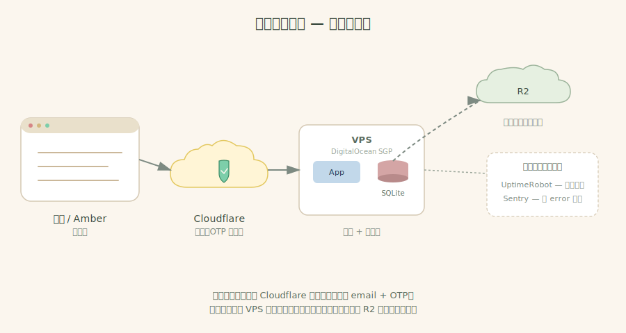
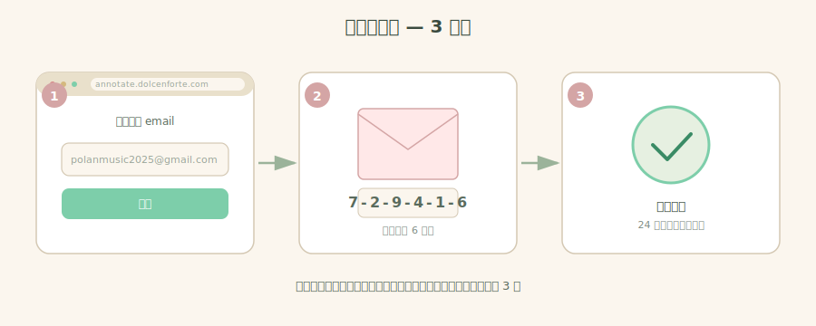
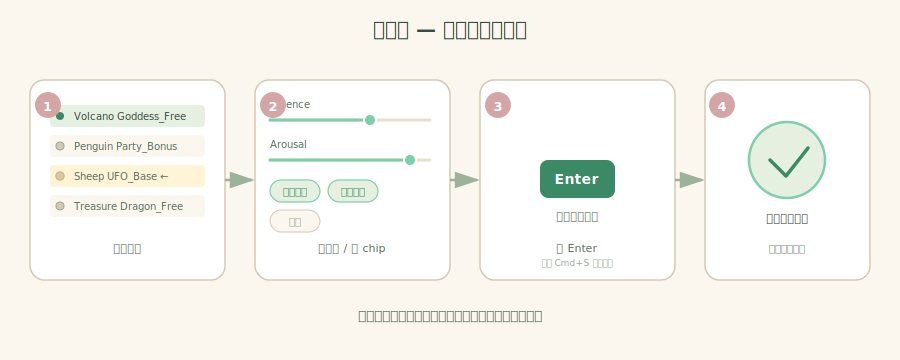

# 珀瀾標註系統 — Amber 使用手冊

> 寫給 Amber 看的，不是工程文件。看不懂的地方就跳過，找 Aaron 問。

---

## 這是什麼

一個讓你跟員工標註 BGM / 音效情緒的網頁工具。打開瀏覽器就能用，不用安裝、不用接 USB、不用開你的 Mac。

**網址：** https://annotate.dolcenforte.com

簡單說：
- 員工開瀏覽器 → Cloudflare 擋一下、要他輸 email + 6 位數驗證碼 → 通過才連到伺服器 → 他改的東西**每秒**自動備份到雲端
- 你跟員工只看到網頁，後面那些雲、伺服器、備份都是自動跑的

---

## 第一次登入（你跟每個員工都要走一次）

1. 打開 https://annotate.dolcenforte.com
2. 輸入你的 email（你的是 polanmusic2025@gmail.com）→ 按「繼續」
3. 去信箱收一封信，裡面有 6 位數字 → 把數字填進網頁

進去後 **24 小時內不用再登入**。換瀏覽器、開無痕、清 cookie 就要重來一次。

> **重點：** 員工不需要 Gmail 帳號，他們用自己平常的 email 就行。你只要把他們的 email 加進「白名單」（後面會教）。

---

## 員工每天怎麼標一筆

1. **選音檔** — 左邊有清單，點任一個還沒標的
2. **標** — 拉滑桿（Valence / Arousal）、點 chip（情緒推進、氛圍營造、慶祝...）
3. **存** — 按 **Enter**（同時儲存並跳下一個）；或按 Cmd+S 只儲存不跳
4. **重複** — 系統自動跳下一個，直到全部標完

> 標到一半關掉電腦也沒關係。下次回來會問「要繼續上次的草稿，還是重新開始」。

---

## 你（Amber）能做什麼，員工不能做的事

你的帳號是 **admin**，畫面右上角會多一個「**音源管理**」連結。員工沒這個。

| 功能 | 你 | 員工 |
|------|----|----|
| 標註音檔 | ✅ | ✅ |
| 看進度 / ICC 一致性 | ✅ | ✅（看自己的） |
| **上傳新音檔** | ✅ | ❌ |
| **匯出 CSV / JSON** | ✅ | ✅ |
| 加新員工到白名單 | ❌（找 Aaron）| ❌ |

---

## 常見任務

### 1. 加一個新員工

**你做不到 — 這個要找 Aaron。** 為什麼？因為加員工是改 Cloudflare 後台、不是網站裡面的功能。

訊息給 Aaron：「請加 OOO@xxx.com 到白名單」就好。Aaron 會在 5 分鐘內處理完。處理完那位員工就能用第一次登入的 3 步驟自己進來。

### 2. 上傳新音檔

1. 右上角點「**音源管理**」
2. 拖音檔進去（支援 wav / mp3 / ogg / m4a / flac，**單檔最大 100 MB**）
3. 上傳成功後，員工那邊清單會自動出現新檔案 — 不用重啟、不用通知，直接標就行

> **注意：** 同名檔會被擋下來。如果你要重傳一個改過的版本，先改檔名（例如加 `_v2`），或在上傳那行勾「覆蓋」。

### 2.5 刪除已上傳的音檔

「音源管理」頁面下半部有**「已上傳音檔」清單**（顯示全部音檔 + 各自的「刪除」按鈕）。

點刪除 → 跳出確認 → 確定 → 刪除：
- 磁碟上的音檔
- 該首所有員工已標的資料

> **不可復原**。萬一誤刪：DB 雲端備份在 R2，可以還原當天某個時間點，但要找 Aaron 處理（5–10 分鐘）。

### 3. 看進度 / 一致性報告

首頁有個「**Dashboard / ICC**」的連結。會顯示：
- 每個員工標了幾筆
- 每個維度的「兩人標的有多接近」（ICC = 0.7 以上算一致）
- 還沒被標到的音檔清單

### 4. 匯出資料給研究 / 訓練模型

首頁「**Export**」連結 → 選 `consensus` (兩人平均) 或 `per_annotator` (每人各自) → 下載 CSV 或 JSON。

匯出檔案不會包含員工的 email，只有 annotator_id（A1、A2、A3...）。

---

## 紅線（千萬別做）

完整版在 [`DANGER_ZONE.md`](DANGER_ZONE.md)，這裡列最重要的 5 條：

1. ❌ **不要把 `.env` 檔案傳給任何人** — 裡面有 R2 / Sentry 的密碼
2. ❌ **不要直接改伺服器上的資料庫檔（`annotations.db`）** — 改了會跟雲端備份打架
   > 這條只限「直接登進伺服器、用 SQL 改 DB」這種事 — 那是工程師才會做的。
   > **你正常從網頁上傳 / 刪除音檔、員工標註存檔，這些 100% 安全**，跟這條無關。
3. ❌ **不要關掉 Litestream 容器** — 那是每秒備份你的資料的東西，關了等於沒備份
4. ❌ **不要分享你的 Cloudflare 後台帳號** — 那個帳號可以加白名單、改網域，給人就是給整個系統的鑰匙
5. ❌ **不要在 GitHub repo 裡 commit 音檔** — 音檔放伺服器就好，repo 只放程式碼

---

## 出事了怎麼辦

### 員工反應「進不去」

先問他：
- 「網址打對嗎？」 https://annotate.dolcenforte.com
- 「你 email 填的是哪個？」 → 跟你給 Aaron 的白名單那個一樣嗎？
- 「驗證碼信收到了嗎？看垃圾信？」

90% 是上面三個。剩下 10% 找 Aaron。

### 「網站打不開 / 一直轉圈」

1. **先換個瀏覽器**（或開無痕視窗）— 8 成是你那邊 cookie 壞了
2. 還是不行 → 找 Aaron（UptimeRobot 24 小時監控著，掛了會自動寄信給我，我通常已經在處理）

> 你不用自己去開監控儀表板。系統一掛掉，UptimeRobot 會在 1 分鐘內 email 通知。

### 「我不小心標錯一筆」

直接點那筆音檔重新標、按 Enter 就會覆蓋舊的。系統會留歷史紀錄，但畫面上看到的就是最新一版。

---

## 一個月要花多少錢

完整版在 [`COSTS.md`](COSTS.md)，總結：

| 項目 | 月費 | 誰付 |
|------|------|------|
| DigitalOcean 伺服器 | $6 | 目前 Aaron，未來轉給你 |
| Cloudflare R2 備份 | $0（免費額度內）| — |
| Cloudflare Access | $0（50 人以下免費）| — |
| 網域 dolcenforte.com | 你已經有了 | 你 |
| **總計** | **約 $6 USD / 月** | |

> Aaron 之後會教你怎麼把 DO 帳單轉到你的卡。

---

## 我（Aaron）走了之後

這份手冊 + 下面這幾個檔案就是完整交付：

- [`USER_GUIDE.md`](USER_GUIDE.md) — 員工 quick start（這份的縮短版，可以直接傳給員工）
- [`ADMIN_GUIDE.md`](ADMIN_GUIDE.md) — 你（admin）的詳細功能說明
- [`TROUBLESHOOTING.md`](TROUBLESHOOTING.md) — 8 種常見故障 + 解法
- [`ARCHITECTURE.md`](ARCHITECTURE.md) — 系統怎麼設計的（給之後接手的工程師看）
- [`DANGER_ZONE.md`](DANGER_ZONE.md) — 完整紅線清單
- [`COSTS.md`](COSTS.md) — 帳單轉移指南

如果你之後找新工程師接手，把整個 GitHub repo 給他、叫他先讀 `ARCHITECTURE.md` + `PHASE6_DEPLOYMENT.md` 就能上手。

---

## 什麼時候該找 Aaron

**找：**
- 加新員工到白名單
- 系統整個掛掉、UptimeRobot 顯示 DOWN
- 出現任何「我不知道是不是正常的」狀況
- 想加新功能（例如新維度、新匯出格式）

**不用找（自己處理）：**
- 員工忘記怎麼用 → 把 `USER_GUIDE.md` 傳給他
- 想上傳音檔 → 自己「音源管理」拖進去
- 想看進度 → Dashboard 自己看
- 想匯出資料 → Export 自己下載

---

## 重要網址清單（書籤起來）

| 是什麼 | 網址 |
|--------|------|
| **標註系統本人** | https://annotate.dolcenforte.com |
| Cloudflare 後台（加白名單）| https://one.dash.cloudflare.com/ |
| Sentry 錯誤通知 | https://polan.sentry.io/ |
| UptimeRobot 監控後台 | https://uptimerobot.com/dashboard（要登入；通常 Aaron 看就好）|
| GitHub repo | （Aaron 會把你加進去）|
| DigitalOcean 後台 | https://cloud.digitalocean.com/ |

---

> **最後一句話：** 你不需要懂背後的技術。會用網頁、會看 email、會傳訊息給 Aaron — 這個系統就會穩穩地跑下去。
